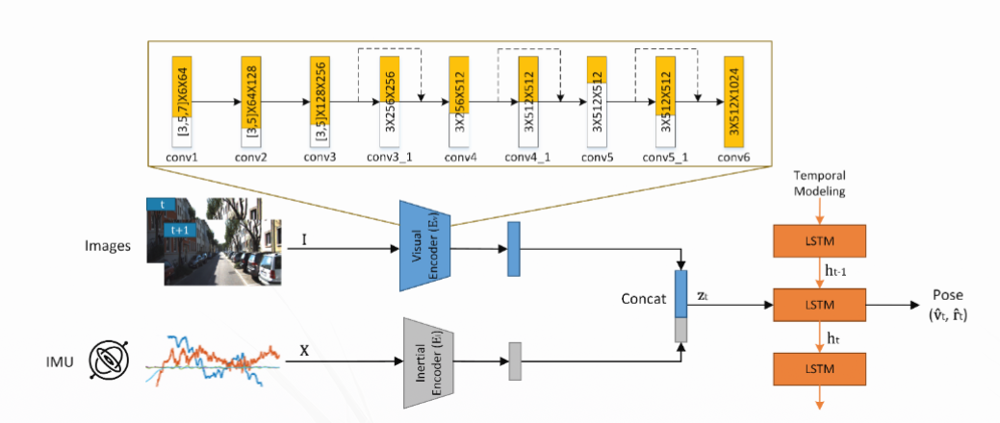
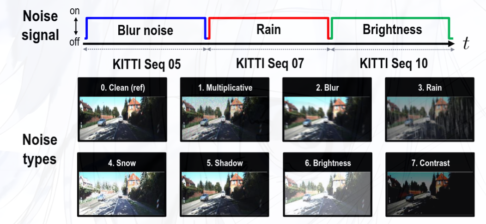
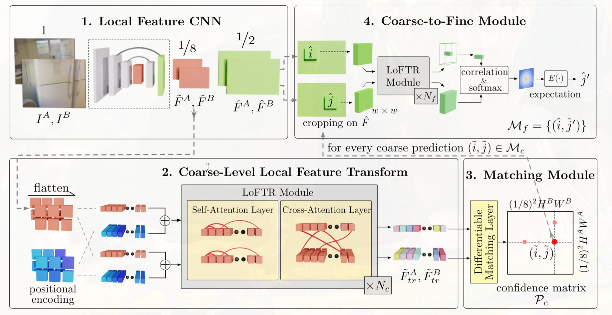
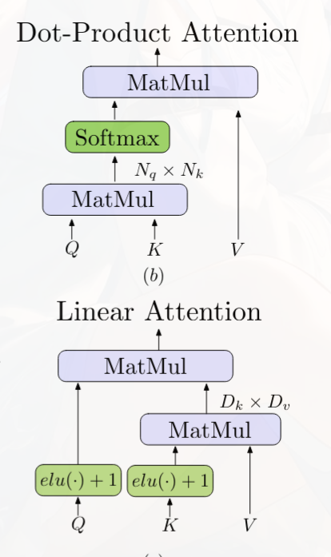

# 7月26日组会汇报

## UL-VIO部分调研

**UL-VIO**[^1] 是一个端到端（不区分模块，直接从输入计算到输出）的VIO模型，是在**NAS-VIO**[^2]的基础上压缩而来，首先说明NAS-VIO的基本结构。

### NAS-VIO的基本介绍
NAS-VIO 在**长短时记忆网络**（LSTM）[^3]基础上构建，通过对图像信息和IMU信息分别编码再直和后送入LSTM构成，结构见下图：

首先，对于图像数据，其通过 **CNN** 和**残差块**对**两帧连续的**图像特征进行编码，再把**两个图像帧**之间的惯性数据编码，把两个编码数据融合后送入LSTM中输出 **6-DoF** 位姿。
其网络架构上，通过LSTM让以往的信息对当前位姿进行矫正，每一帧上直接对全局提取特征，避免了特征点较少带来的麻烦。但是视觉编码器中全CNN架构，会导致其对光照的鲁棒性不佳。
相比与其网络架构，其训练过程中对网络架构的优化才是其性能优化的主因。在训练中，各个模块联合训练。同时对于架构选择，其采用了**神经架构搜索**（NAS）的方法，也就是通过算法自行决定几个可能最好的网络架构，再手动对这些架构测试。这里使用 **One-Shot NAS** ，也就是只训练最大子网络，从最大子网络中**剪裁**的，得到不同的网络架构。举例来说，如果某一层卷积核有7 * 7、5 * 5、3 * 3大小，那么在训练中只会训练7 * 7大小的网络，然后对网络评估时候，从7 * 7网络中心剪裁出来更小的网络，进行评估。层级数的选取同理，特征的层数训练时按最大层数处理，但是当评估时候选择前面几个层级，就可以对更小的层级结构进行评估。此外，还有层的跳过与否可以选择。这样做的好处是，可以显著降低架构选择的成本。架构选择上，一般训练时间远超过评估时间，这样一次训练出结果再评估，使得在较大范围内搜索模型架构成为了可能。但是这样操作，显然基于几个不严格的预设：
1. 中心和边缘参数不耦合。
2. 前后层级参数不耦合。
3. 参数数目的增加，和参数具体收敛数值无关，以很简单的方式导致性能和计算量的增加。
事实上，这些问题会很明显影响模型性能，论文作者也意识到了这件事。在训练过程中，不是固定模型架构，而是逐渐开放更小的卷积核尺度选择（这里拿卷积核的大小这一可选参数举例，其余同理），使得模型适应未来评估时候的被裁剪的网络。也就是**渐进收缩**的策略。但渐进收缩导致了模型可能遗忘了最大网络的训练。于是这里在训练时候，每500步，会要求强制同时采样最大子网和最小子网以及随机几个中间子网，从而保证各个层级的网络都能够稳定训练，也就是**三明治规则**。同时，为了减少架构搜索范围，训练分成几个阶段进行，每阶段只对某一类参数选择，比如第一阶段只对不同卷积核大小选择，下个阶段再决定需要多少层特征图……
这样，作者发现经过训练，网络在保证精度损失不超过 **10%** 的情况下，网络大小达到了全尺寸网络的 **3%** 左右，效果十分显著，此时模型大小大致是 **34.42M** 。

### UL-VIO的优化策略
UL-VIO在经过优化后，把模型的大小压缩到 **1M** 以下，下面是其主要优化策略：
1. 首先 UL-VIO对模型的噪声鲁棒性进行增强，在对模型输入图像时候，会先对图像叠加一层噪声，从而增加UL-VIO的鲁棒性。其处理实际更加复杂，下面会再次提到这一点。
图中，上面时间轴对应训练时候选择的数据序列编号和噪声类型，
2. 同时，UL-VIO在部分环节保留基本结构并且适当减少参数，如视觉编码器部分，减少卷积层数，并增加平均池化层保持效果；惯性编码器部分缩减通道数量。
3. 把LSTM替换成**全连接层**因为事实上连续两帧之间的信息包含了足够的运动信息，从而大量减少了参数量。
4. **运行时适应**（TTA）。这一步相当于在运行时实时更新视觉编码器的特定BN层。其从几个图片中叠加不同类型噪声后提取出特定BN层输入的均值和标准差，构建成键值是噪声类型的特征值字典。如果当前视觉和惯性计算出位姿差异过大，就会触发依照当前视觉编码特征查阅字典，寻找最接近的噪声类型。只要这个最接近的噪声类型不是*无噪声*，就会触发TTA，从字典中加载对应BN层参数，并通过$L_{TTA}$这个特殊的损失函数实时更新参数。TTA的设计是源于实验中发现，如果测试是噪声类型和训练时候差别大或者训练时没考虑噪声干扰，就会导致视觉输出位姿剧增。

下面是UL-VIO优化的整体结果：
|指标|NAS-VIO|UL-VIO|变化|
|:---|:---|:---|:---|
|模型大小|34.42 M|0.944 M|-97.3%|
|相对平移误差 |基线|+1.11%|仅+1%|
|相对旋转误差 |基线|+1.05°|微小增加|
|测试时自适应|不支持|支持|新增能力|

各部分对优化影响如下：

|       模块       |  NAS-VIO（原始） |  UL-VIO（改造后） |          改造方式         |   压缩倍数  |
| :------------: | :----------: | :----------: | :-------------------: | :-----: |
|  $E_{visual}$  |    17.69 M   |    ~0.15 M   | 保留BN参数，末尾加AveragePool |   117×  |
| $E_{inertial}$ |    0.85 M    |    ~0.11 M   |         缩减通道数         |    8×   |
|   $D_{fused}$  |    15.88 M   |    ~0.10 M   |       LSTM → FC       |   161×  |
| $D_{inertial}$ |       无      |    ~0.58 M   |      新增模块（用于TTA）      |    新增   |
|     **总计**     | **~34.42 M** | **~0.944 M** |           —           | **36×** |

其整体在基本不影响性能的同时大幅压缩模型。这种量级的模型整体甚至没有一个特征匹配模型的一半大小。同时其端到端的构造方式，意味着我们可能能回避很多知识缺失问题，不需要大量时间投入学习各种滤波和优化算法。

## LoFTR部分调研[^4]

LoFTR采用了**注意力机制**实现匹配，相较于一般的方法，它可以在特征检测的效果不佳情况下完成匹配，但是这也意味着其算力开销是较大的。
首先，LoFTR对图像进行CNN下采样得到粗编码，然后上采样得到细编码。粗编码会用于在全局粗略搜索匹配点，细编码用于得到匹配点大致位置后裁剪窗口精确匹配点的位置。在粗细两个匹配阶段，都是用*LoFTR Module* 实现的，这个模块是一个自注意力和交叉注意力模块，从而使得特征图获得上下文信息编码。在注意力的处理部分，本文采用了特殊的 *Linear Attention* ，来降低计算复杂度使得计算效率提升。
一般注意力是 $$ A(Q,K,V) = Softmax(\frac{Q K^T}{\sqrt{d_k}})V $$ 而Q,K,V 都是$N \times d$ 的矩阵，其中 $N\gg d$ ,此公式复杂度是 $O(N^2)$ 但是，本文中使用的方法是用特殊的Softmax函数，使得
$$
A = Softmax(\frac{Q K^T}{\sqrt{d_k}})V = Softmax(Q)(Softmax(K)^T V)
$$
从而把时间复杂度降低到 $O(N)$，如图。

此模型参数数量接近 10M,甚至比 UL-VIO本身还大，因此要集成到UL-VIO中，显得过重。同时，UL-VIO是端到端的模型，意味着其对这种输出为匹配点的模式并不刚需，甚至可能效果反而不好，故而直接把LoFTR作为UL-VIO的视觉处理端是不合理的。但是对于低纹理特征的区域，这种不需要特征检测的思路又十分值得借鉴。
Efficient LoFTR的方案没有细读，但是其核心方法并没有改变，只是不再浪费地执行全局注意力以及对细匹配模块的特征的处理优化。

Efficient LoFTR和UL-VIO的直接融合是不合适的，两者的思路使得其并不兼容。但是可以把LoFTR的注意力模块搬到UL-VIO的解码器前面，使得UL-VIO的融合解码器能够在特征图的每一个点上读到上下文信息，提高其在特征稀疏情况下的表现。同时，UL-VIO可以独立计算惯性得到的位姿信息，这将为交叉注意力的计算提供一定约束，提高LoFTR注意力计算的性能（注意力的计算往往是最花费时间的一步）。

[^1]: [GitHub仓库链接](https://github.com/jp4327/ulvio)，论文链接见仓库`README`文件。
[^2]: 论文[*SEARCH FOR EFFICIENT DEEP VISUAL-INERTIAL ODOMETRY THROUGH NEURAL
ARCHITECTURE SEARCH*](https://ieeexplore.ieee.org/stamp/stamp.jsp?tp=&arnumber=10095166) 需要通过学校图书馆访问。
[^3]: 此前并未提到需要大家了解，但这部分在UL-VIO中被大幅简化，可以通过[视频](https://www.bilibili.com/video/BV1zD421N7nA/?vd_source=7f8713ac3bd7bb796f9a07d62a2ecaeb)了解。
[^4]: [论文网址](https://arxiv.org/pdf/2104.00680)；如果对注意力机制不熟悉，可以bilibili*3Blue1Brown* 系列了解基本概念，此论文对其也有解释。