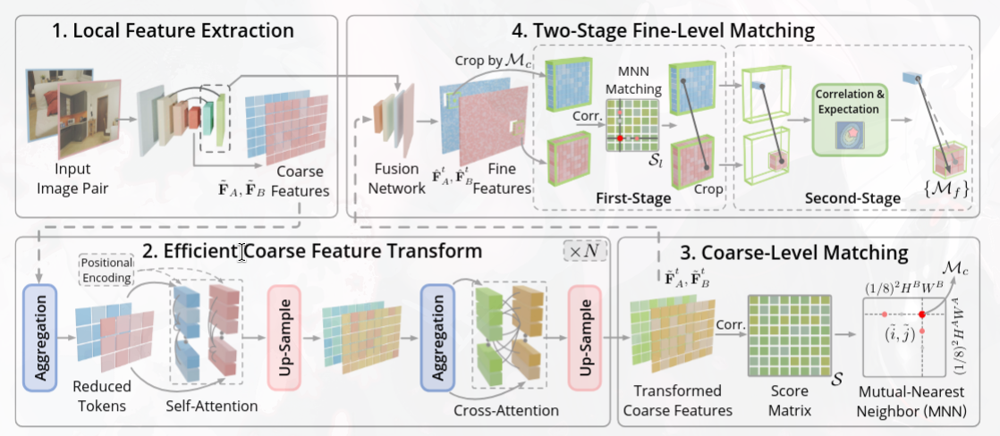
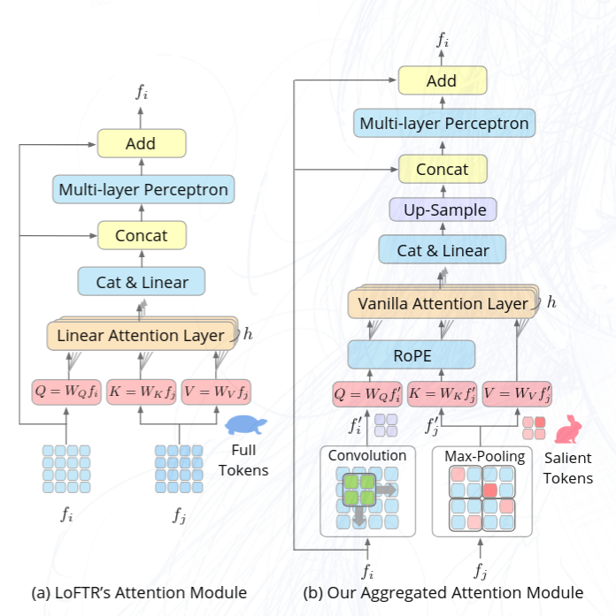
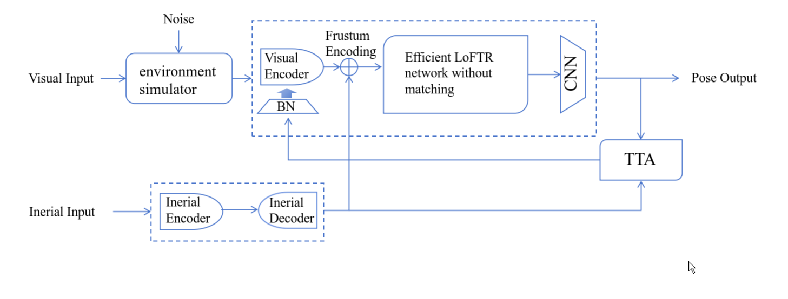

# 7月31日组会报告

## Efficient LoFTR 的改进方案



## 1. 视觉特征提取网络的精简

LoFTR 使用 **ResNet** 作为骨干网络。ResNet 在**训练**和**推理**时都保持多分支结构（跨层跳跃连接、3×3 卷积 + 1×1 卷积的 bottleneck 等），推理时这些分支持续占用计算资源，导致速度慢。

### RepVGG 重参数化骨干

```
训练阶段（RepVGGBlock 包含多条分支）：
        输入
        ╱ ╲ ╲
   3×3卷积 1×1卷积 恒等连接(跳跃)
        ╲ ╱ ╱
       加法(Σ)
        │
       输出

推理阶段（通过重参数化融合成一分支）：
        输入
        │
   1×3×3卷积（融合后的单一卷积）
        │
       输出
```

**重参数化原理**：推理时，将那三个平行分支的卷积核和偏置**数学上合并为一个 3×3 卷积**，得到一组等效权重。这与您之前在超网络里看到"大核包含小核"的思路呼应——这里是将多个小卷积累加成一个大卷积。

RepVGGBlock 的训练时候的计算为：
$$y = \text{BN}(\text{Conv}_{3\times3}(x)) + \text{BN}(\text{Conv}_{1\times1}(x)) + x$$

推理时合并为：
$$y = \text{Conv}_{3\times3}'(x) + b'$$


## 2. 粗匹配部分的聚合注意力与注意力机制改进

### 2.1 原始问题

LoFTR 在**整张粗特征图**上做全局注意力：

```
粗特征图：640×480 图像经 8× 下采样 → 80×60 = 4800 个 token

自注意力复杂度：O(N²·d) = O(4800²·d) ≈ O(23M·d)
→ N×N 注意力矩阵含 23M 个元素 → 计算量巨大
```

相邻像素的特征高度相似，它们所需的全局上下文也几乎相同。对每个像素都做一次注意力，是**大量冗余计算**。

### 2.2聚合注意力（Aggregated Attention）


```
步骤1 - 自适应 token 选择（Adaptive Token Selection）
  原始稠密特征图中，自适应挑选一组代表 token（而非全部）
  其中对于Query部分特征，经过卷积核压缩
  对于Key和Value部分的特征，经过最大池化层压缩

步骤2 - 聚合（Aggregation）
  将选中的相邻 token 特征聚合起来，形成紧凑的代表特征集 T_agg

步骤3 - 注意力（Attention）
  只在聚合后的少量 token 上做标准 Transformer（自注意力+交叉注意力）
  复杂度从 O(4800²) 降为 O(N_selected²)，N_selected << 4800

步骤4 - 广播（Broadcast）
  将每个代表 token 的注意力结果广播回它所覆盖的相邻区域
  （因为相邻特征相似，直接复制是合理的）
```

**复杂度缩减估计**：

$$\text{全注意力} = O(N^2 d), \quad \text{聚合注意力} = O\left(\left(\frac{N}{k}\right)^2 d\right)$$

### 2.3 注意力方式的改进
由于聚合注意力使得token数目减少，所以不必在使用 **Linear Attention**（这种注意力虽然降低了计算量，但是实验证明其会使得表征能力下降）， 而是可以直接使用 **Vanilla Attention** 表达能力更强，也就是$$ A(Q,K,V) = Softmax(\frac{Q K^T}{\sqrt{d_k}})V $$

### 2.4 推理时跳过 dual-softmax

粗匹配阶段 LoFTR 使用 **dual-softmax**（对行、列两个方向分别做 softmax）来得到匹配置信度：

```
S = 交叉注意力后的相似度矩阵
Dual-softmax: P = softmax(S, dim=row) ⊙ softmax(S, dim=col)
```

论文发现 dual-softmax **主要用于训练**提供梯度信号，让网络学会判别特征；当特征已经足够好时，dual-softmax表现和正常相似度计算其实相差不大，**推理阶段可以直接省略**。


## 3. 精细匹配部分

### 3.1 精细特征图获取时候复用粗特征 + 浅层融合

重新利用已经在**粗阶段 Transformer**处理过、含跨视图信息的特征 F̃，而不是重新算：

```
F̃ᵗ（1/8分辨率，含跨视图匹配信息）
   │
   ├─ 上采样 → 与 Backbone 1/4 分辨率特征融合（拼接 + 卷积）
   │
   ├─ 上采样 → 与 Backbone 1/2 分辨率特征融合（拼接 + 卷积）
   │
   └─ 上采样 → 全分辨率的精细特征 F̂

整个融合网络只有浅层卷积，无额外 Transformer → 异常高效
```

### 3.2 两阶段精炼

LoFTR 原版在精细匹配时，直接在较大窗口（5×5/7×7）上做 softmax + expectation：

```
在整张 5×5/7×7 相关性 patch 上：
  P(i,j) = softmax over 25 或 49 个位置
  期望坐标 = ΣΣ P(i,j) · (Δx, Δy)
```

当特征相关性存在噪声时，softmax 把概率**摊平到整个大窗口**，期望值被噪声拉偏 → 亚像素精度下降。


#### 第一阶段：像素级匹配（MNN）

```
在精细特征 patch 上计算局部相关性矩阵 Sₗ
     │
     └─ Mutual Nearest Neighbor (MNN) 搜索
          a→b 最近邻 AND b→a 最近邻 才保留
     │
     └─ 按相关性分数排序，每个粗匹配保留 top-1
     │
     └─ 得到像素级精确匹配 (u, v)
```

MNN 采用**硬匹配**（argmax），不涉及 softmax 概率摊平，因此**无噪声扩散问题**。且推理时不需要 softmax，更高效。

#### 第二阶段：亚像素级精炼

```
以像素级匹配 (u,v) 为中心，裁剪 3×3 极小窗口
     │
     └─ 与图像A特征做相关性 → 3×3 分数矩阵 S
     │
     └─ softmax → 概率分布 P(i,j)
     │
     └─ 期望 → 亚像素偏移
```

亚像素偏移计算：

$$\Delta u = \sum_{i}\sum_{j} P(i,j)\, \Delta x(i,j), \qquad \Delta v = \sum_{i}\sum_{j} P(i,j)\, \Delta y(i,j)$$

最终精确匹配：

$$(u_{\text{final}}, v_{\text{final}}) = (u + \Delta u,\; v + \Delta v)$$

---
## UL-VIO和LoFTR的融合设想


以上是示意图，如图，可以把UL-VIO的视觉部分替换为LoFTR经过注意力机制的特征图，同时为了提高图像特征输出的效率，可以把惯性部分的输出用于视觉注意力部分的编码。

沿用UL-VIO的TTA部分以及环境噪声的叠加训练，从而增强对光照和环境噪声鲁棒性。

此外，如果效果大不到预期，还可以根据实际模型参数量级把BN换成IBN或者增加其他光照适应模块。

---
下一步，调研已经实际使用LoFTR前端的VIO模型的技术方案，阅读UL-VIO以及Efficient LoFTR代码，并测试UL-VIO模型在低纹理环境数据集下的表现，从而对方案进行验证纠错和改进。


