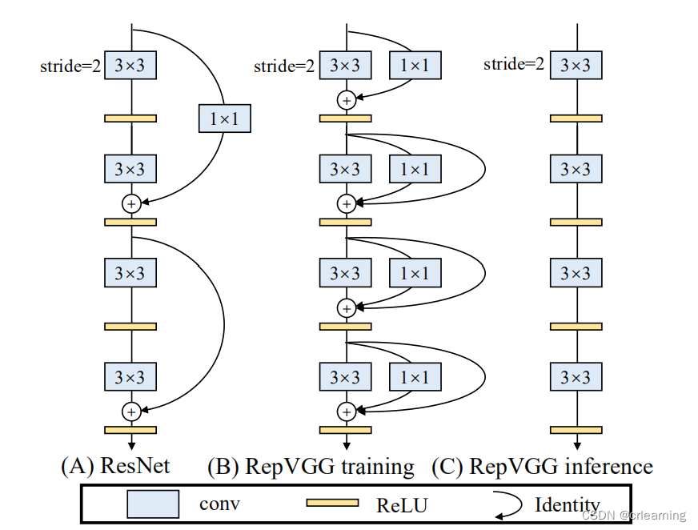
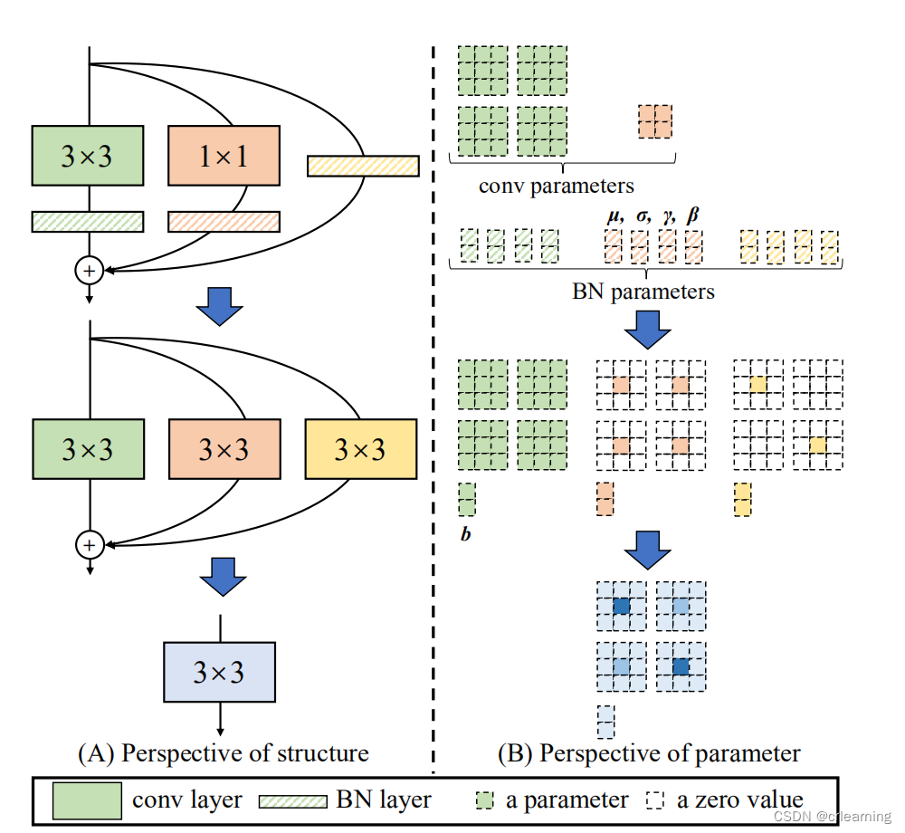

## 8月12日组会汇报

### UL-VIO网络结构简述

以下部分忽略了对噪声适应模块的处理（噪声叠加，TTA等）。

#### 整体概述

对视觉和IMU信息先单独处理，然后融合两者中提取的特征，再经过隐藏层，全连接层输出结果。

#### 视觉部分

视觉部分的输入是 B 个Batch的图像序列，记作 v 。 大小 [B, S, C, H, W]，其中，S 是每个Batch图像的序列长度，C是图像的通道数量，（H, W)是图像的尺寸。

由于训练过程中是无记忆的，也就是目前帧输出结果和以前没有关系，所以要把图像数据变成相邻两个图像一组的形式，也就是

```python
        v = torch.cat((v[:, :-1], v[:, 1:]), dim=2)
```

其中dim=2就是把相邻图像在通道维度上合并上，这样C的索引就是：0-2：第一帧图像的RGB，3-5：第二帧图像的RGB。随后

```python
v = v.view(batch_size * seq_len, v.size(2), v.size(3), v.size(4))
```

这一步把B和S的索引合并，因为在训练过程中，每两帧是单独训练的，batch和seq的区分并不明显。（后续还需要恢复，把B和S分开）

在网络架构上，

```python
# 部分一：卷积
        self.conv1 = ConvLayer(6, 8, kernel_size=5, stride=2, use_norm=self.batchNorm, norm_func='BN', act_func='lrelu')
        self.conv2 = ConvLayer(8, 16, kernel_size=3, stride=2, use_norm=self.batchNorm, norm_func='BN', act_func='lrelu')
        self.conv3 = ConvLayer(16, 64, kernel_size=5, stride=2, use_norm=self.batchNorm, norm_func='BN', act_func='lrelu')
        self.conv4 = ConvLayer(64, 64, kernel_size=3, stride=2, use_norm=self.batchNorm, norm_func='BN', act_func='lrelu')
        self.conv4_1 = ConvLayer(64, 64, kernel_size=3, stride=1, use_norm=self.batchNorm, norm_func='BN', act_func='lrelu')
        self.conv5 = ConvLayer(64, 192, kernel_size=3, stride=2, use_norm=self.batchNorm, norm_func='BN', act_func='lrelu')
        self.conv5_1 = ConvLayer(192, 64, kernel_size=3, stride=1, use_norm=self.batchNorm, norm_func='BN', act_func='lrelu')
        self.conv6 = ConvLayer(64, par.visual_f_len, kernel_size=3, stride=2, use_norm=self.batchNorm, norm_func='BN', act_func='lrelu')
# 部分二：池化
        self.avgpool = nn.AdaptiveAvgPool2d(1)
# 部分三：线性
        self.visual_head = nn.Linear(par.visual_f_len, par.visual_f_len)
```

第一部分卷积，提取图像的256维特征，第二部分池化，把每一维度的特征图变成特征值,第三部分线性层，增强语义信息。

#### IMU部分

IMU部分的初步处理和视觉类似，第一步都是先把数据整理成两帧之间的一组，在默认情况下，图像获取速度是10fps,IMU是100fps,因而两帧图像之间有11帧的IMU数据。

```python
        ll = 11 + self.par.imu_prev
        imu = torch.cat([imu[:, i * 10:i * 10 + ll, :].unsqueeze(1) for i in range(seq_len)], dim=1)
```

这里的`self.par.imu_prev`似乎是想要在训练过程中提前获得下一帧图像之后的一些IMU数据用来增强训练效果？，但是在配置文件中，此数值被设定为0,也就是可以忽略。经过此步骤，imu数据格式从[B, S', C']（这里C'是六自由度的位姿信息,S'是IMU序列帧数），变成[B, S, ll, C']，从而和视觉部分数据对齐。

接下来送入一维卷积：

```python
# 卷积
self.encoder_conv = nn.Sequential(
            nn.Conv1d(6, imu_h0_len, kernel_size=3, padding=1),
            nn.BatchNorm1d(imu_h0_len),
            nn.LeakyReLU(0.1, inplace=True),
            nn.Dropout(par.dropout),
            nn.Conv1d(imu_h0_len, par.imu_hidden_size, kernel_size=3, padding=1),
            nn.BatchNorm1d(par.imu_hidden_size),
            nn.LeakyReLU(0.1, inplace=True),
            nn.Dropout(par.dropout),
            nn.Conv1d(par.imu_hidden_size, par.imu_hidden_size, kernel_size=3, padding=1),
            nn.BatchNorm1d(par.imu_hidden_size),
            nn.LeakyReLU(0.1, inplace=True),
            nn.Dropout(par.dropout))
        len_f = par.imu_per_image + 1 + par.imu_prev
        #len_f = (len_f - 1) // 2 // 2 + 1
# 线性层
        self.proj = nn.Linear(par.imu_hidden_size * 1 * len_f, par.imu_f_len)
```

这里有dropout层的存在，但应该是训练时为了泛化特性而存在，在配置文件中是0,先可以忽略。

#### 融合部分

在这一部分中把视觉特征和IMU特征融合输出为位姿信息。

```
        self.f_len = par.imu_f_len + par.visual_f_len
```

就是直接相加。

然后通过几个线性层，就可以得到位姿。

```python
        self.mlp = nn.Sequential(
                        nn.Linear(f_len, par.mlp_hidden_size),
                        nn.LeakyReLU(0.1, inplace=True),
                        nn.Linear(par.mlp_hidden_size, par.mlp_hidden_size))
        self.mlp_drop_out = nn.Dropout(par.mlp_dropout_out)
        self.regressor = nn.Sequential(
            nn.Linear(par.mlp_hidden_size, par.mlp_hidden_size),
            nn.LeakyReLU(0.1, inplace=True),
            nn.Linear(par.mlp_hidden_size, 6))
```

### Efficient LoFTR 视觉backbone网络的结构

LoFTR的网络结构是RepVGG结构，这种网络相比于ResNet,特点是训练时各分支独立运行，推理时各分支合并，从而推理比训练快得多。
训练时，RepVGG三个分支，3*3,1*1,和identify独立进行。

推理时候，重参数化，把三个分支以及随后的BatchNorm合成一个3\*3卷积核。如图

EfficientLoFTR中，采用了四个阶段的下采样，每次下采样若干个RepVGG块，提取出1/2、1/4、1/8分辨率特征图。

### 方案

1. 采用RepVGG作为backbone,输出结果送入到自注意力层(去掉交叉注意力，把交叉注意力用原UL-VIO的高倍率下采样代替)，随后通过拼接融合两张特征图（分别来自输入的两张图像），送入卷积层下采样并拓展通道得到视觉特征。可以通过聚合自注意力 Ray-PE 编码，直接将IMU提供的位姿编入位置编码实现V、I融合，视觉输出就是融合特征(方案A1)。也可以采用原UL-VIO方案的正常RoPE编码，IMU输出特征直接和视觉特征相加，得到融合特征（B1）

2. 视觉部分全部采用注意力，完全将EffcientLoFTR的粗分辨率注意力(包含自注意力，交叉注意力)模块搬到UL-VIO的视觉模块，然后对输出特征图的结果去卷积下采样。同样IMU融合有两种方法（方案A2,B2）。但这么做，显然参数量和计算量会比较大。

3. 其他方案
